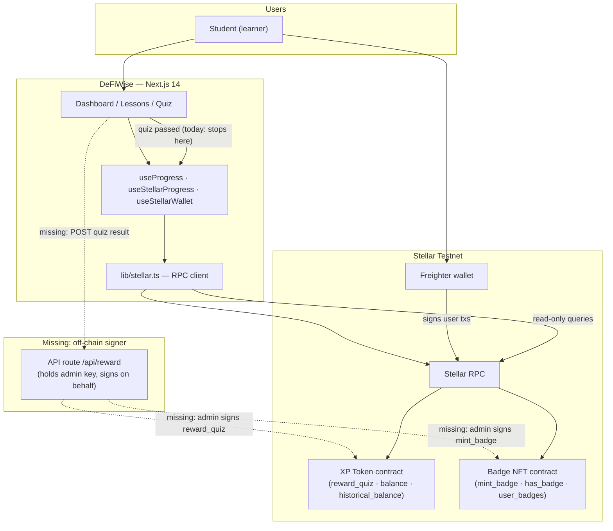
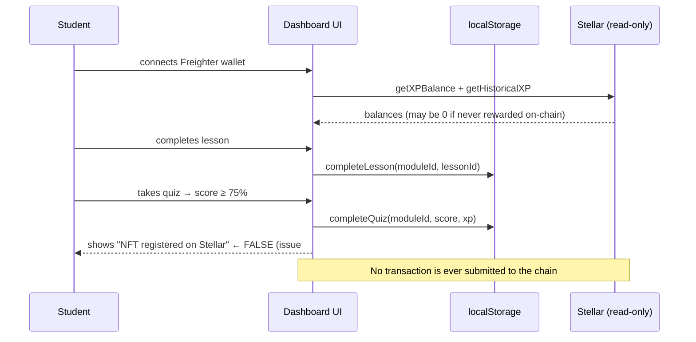
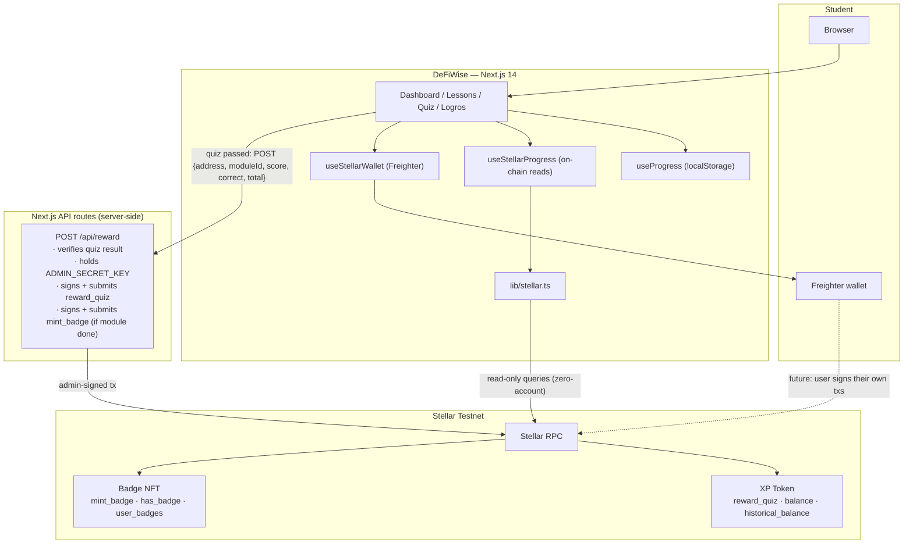
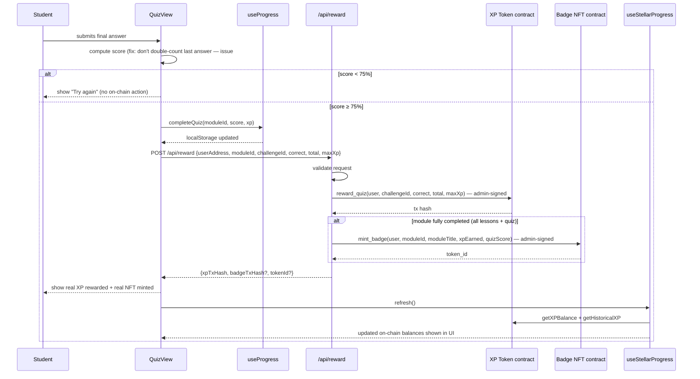
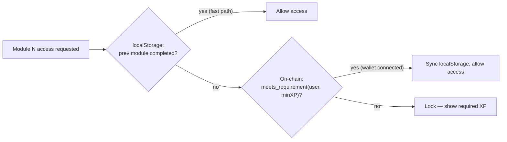
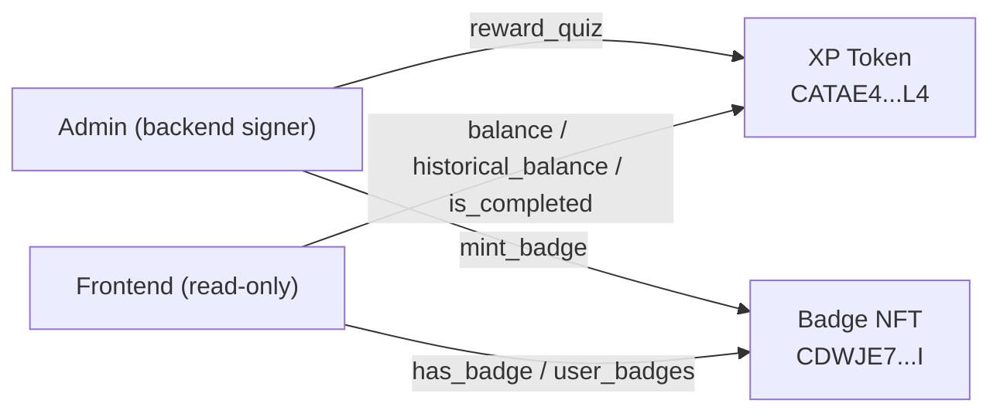
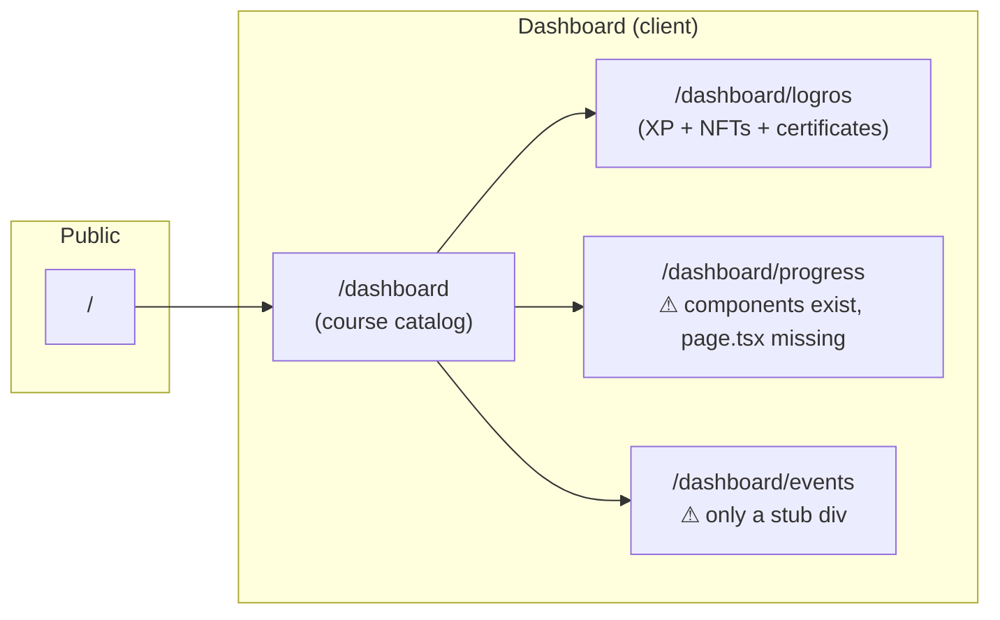
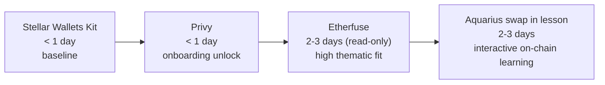

# DeFiWise — Architecture

**A Spanish-language DeFi education platform where learning is on-chain.**

This document describes the DeFiWise architecture: what exists today, what is architecturally missing, how the contracts and frontend connect, and the flows that need to be built. Diagrams use [Mermaid](https://mermaid.js.org/) and render on GitHub. The final section covers possible integrations evaluated for the [Stellar PULSO Hackathon](https://dorahacks.io/hackathon/stellar-pulso-hackathon/detail).

---

## 1. High-level overview



DeFiWise is a structured DeFi learning path where students complete lessons, pass quizzes (≥75%), and earn on-chain rewards: **XP tokens** (fungible, accumulated across all modules) and **badge NFTs** (one per completed module). Both live on Stellar Testnet as Soroban contracts.

The app has two progress layers that must stay in sync — but today they do not, because the on-chain write path is not connected. That is the central architectural gap.

---

## 2. What the application does today

### 2.1 User flow (current)



### 2.2 User roles

| Role | Current state |
|---|---|
| **Student (no wallet)** | Can browse and read lessons. Progress saved in localStorage only. |
| **Student (Freighter connected)** | Can also see on-chain XP balance and badge status, but the chain is never written to after a quiz. |
| **Admin** | Needs to call `reward_quiz` and `mint_badge` but there is no mechanism to trigger this from the app. |

---

## 3. Architecture gaps

This section maps the open issues to the architectural layer that is missing.

### 3.1 The on-chain write path does not exist

`reward_quiz` and `mint_badge` both require `admin-auth`. The admin private key **cannot live in the frontend**. A backend signer is needed to bridge the gap between a passed quiz and an on-chain reward.

| Issue | Root cause |
|---|---|
| #15 — Quiz result claims "NFT registered on Stellar" | There is no transaction submitted. The UI lies. |
| #16 — `reward_quiz` not called after quiz completion | The frontend has no authority to call it (admin key). |
| #17 — `mint_badge` not called on module completion | Same reason. |
| #18 — No backend admin signer | This is the missing infrastructure that blocks #15, #16, #17. |

### 3.2 Missing routes

| Issue | Route | State |
|---|---|---|
| #19 | `/dashboard/progress` | Components exist (`Progress.tsx`, `Compite.tsx`) but no `page.tsx` — route 404s |
| #20 | `/dashboard/events` | Only a `<div>Events screen</div>` stub |

### 3.3 Other gaps

| Issue | Description |
|---|---|
| #13 | Last correct quiz answer counted twice — inflates score |
| #14 | "Previous" button in `LessonView` navigates forward |
| #21 | Dead code from previous design iterations |
| #22 | Only one course exists (`intro-defi`). The platform is a single path. |

---

## 4. Target architecture



### 4.1 What changes

| Layer | Today | Target |
|---|---|---|
| `useProgress.ts` | Single source of truth | Local cache only — triggers API call on quiz pass |
| `lib/stellar.ts` | Read-only helpers + unsigned arg builders | Unchanged — arg builders are used by the API route |
| `/api/reward` | Does not exist | New API route: receives quiz result, builds + signs + submits both `reward_quiz` and `mint_badge` if module is complete |
| `QuizView.tsx` | Marks localStorage, shows false claim | After localStorage update, calls `/api/reward`, shows real tx hash |
| `useStellarProgress.ts` | Polls on connect | Also re-polls after `/api/reward` responds (via `refresh()`) |

---

## 5. Critical flows

### 5.1 Quiz completion → on-chain reward (target)



### 5.2 Module unlock gating

Today, `isModuleUnlocked` reads from localStorage only. In the target state, the authoritative check for unlock gating uses `historical_balance` (append-only, never decreases) via `meets_requirement` on the XP contract. localStorage remains the fast path; on-chain is the source of truth.



### 5.3 Logros page (on-chain truth)

`/dashboard/logros` today reads from localStorage only. After the backend signer is in place, `EarnedNfts.tsx` and `XPSummary.tsx` should read from `useStellarProgress` — which calls `hasBadge` and `getHistoricalXP` from the chain — and fall back to localStorage when no wallet is connected.

---

## 6. The contracts



### 6.1 XP Token (`xp-token`)

Address: `CATAE4HXRWEIVGI2ZW5NGRXIQDNFWZ4YLAKXUU3Q3FKBDT2MPGJECTL4`

| Function | Auth | Description |
|---|---|---|
| `initialize(admin)` | — | One-time setup; panics if already set |
| `reward_quiz(user, challenge_id, correct, total, max_xp)` | Admin | Computes `reward = (max_xp * correct) / total`; updates `Balance` + `HistoricalBalance`; emits `("xp_mint", user) → reward`; marks challenge completed. Panics if already completed. |
| `balance(user)` | — | Current XP (could theoretically decrease in future) |
| `historical_balance(user)` | — | All-time XP — **use this for unlock gating**, never decreases |
| `is_completed(user, challenge_id)` | — | Whether a specific quiz has been rewarded |
| `meets_requirement(user, min_xp)` | — | Compares `historical_balance` to a threshold |
| `total_supply()` | — | Total XP minted across all users |

Storage keys: `Admin` (instance), `Balance(Address)` (persistent), `HistoricalBalance(Address)` (persistent), `TotalSupply` (instance), `CompletedChallenge(Address, String)` (persistent).

**Invariants:**
- `HistoricalBalance` is append-only — it never decreases. Gate unlocks on this value, not `Balance`.
- `CompletedChallenge(user, challenge_id)` is a one-way flag. A second call to `reward_quiz` with the same `challenge_id` panics.

### 6.2 Badge NFT (`badge-nft`)

Address: `CDWJE7AM3DFWC6FD2RKBASWP7EITQ2ULJH4FX5JFQRVHXQSXDPJAB3KI`

| Function | Auth | Description |
|---|---|---|
| `initialize(admin)` | — | One-time setup; sets `NextTokenId = 1` |
| `mint_badge(user, module_id, module_title, xp_earned, quiz_score)` | Admin | Panics if `ModuleBadge(user, module_id)` already exists. Stores `BadgeInfo`, appends to `UserBadges`, maps `ModuleBadge`. Emits `("badge", user) → token_id`. |
| `get_badge(token_id)` | — | Returns full `BadgeInfo` struct |
| `user_badges(user)` | — | Vec of token IDs owned by user |
| `has_badge(user, module_id)` | — | Whether user has completed a specific module |
| `total_badges()` | — | `NextTokenId - 1` |

`BadgeInfo` stored per token:
```
owner: Address
module_id: String
module_title: String
xp_earned: i128
quiz_score: u32
timestamp: u64   ← ledger timestamp at mint
```

**Invariants:**
- One badge per user per module — `mint_badge` panics on second attempt with the same `(user, module_id)` pair.
- `NextTokenId` is auto-incrementing from 1; never reused.

---

## 7. The two progress layers

| Layer | Backed by | Hook | Fast? | Requires wallet? | Source of truth for |
|---|---|---|---|---|---|
| **Local** | `localStorage` | `useProgress.ts` | Yes | No | Lesson completion, quiz scores, local XP display |
| **On-chain** | Stellar Testnet | `useStellarProgress.ts` → `stellar.ts` | No | Yes | Authoritative XP balance, badge ownership, unlock gating |

**Sync rule:** localStorage is always written first (optimistic). The API call to `/api/reward` follows. `useStellarProgress.refresh()` is called after the API responds to pull the authoritative state back into the UI.

**Read-only queries** in `lib/stellar.ts` use a zero-sequence throwaway account (`GAAA...AWHF`) — no Freighter interaction needed, safe to call any time.

---

## 8. Routes



| Route | File | State | Notes |
|---|---|---|---|
| `/` | `app/page.tsx` | Done | Static marketing: Hero + Advantages + Methodology |
| `/dashboard` | `app/dashboard/page.tsx` | Done | Manages `View` state machine: catalog → course → lesson → quiz |
| `/dashboard/logros` | `app/dashboard/logros/page.tsx` | Partial | Reads localStorage only; needs `useStellarProgress` integration |
| `/dashboard/progress` | — | Missing | `Progress.tsx` and `Compite.tsx` components exist under `dashboard/progress/` but no `page.tsx` (issue #19) |
| `/dashboard/events` | `app/dashboard/events/page.tsx` | Stub | Just `<div>Events screen</div>` (issue #20) |

---

## 9. Tech stack

| Layer | Technology | Notes |
|---|---|---|
| **Contracts** | Rust + `soroban-sdk 23.1.0` | Two contracts in `contracts/` workspace |
| **Web** | Next.js 14 + React + Tailwind | App router, all in Spanish (`lang="es"`) |
| **Stellar SDK** | `@stellar/stellar-sdk` | Build, simulate, assemble, submit, RPC reads |
| **Wallet** | `@stellar/freighter-api` | `isConnected`, `getAddress`, `requestAccess`, `signTransaction` |
| **Progress (local)** | `localStorage` | Hydration-safe via `useHydrated()` in `lib/hydration.ts` |
| **Progress (chain)** | Stellar RPC `simulateTransaction` | Read-only via zero-account throwaway |
| **Notifications** | `react-hot-toast` | Toaster in root layout |

---

## 10. Project structure

```
defiwise-stellar/
├── src/
│   ├── app/
│   │   ├── page.tsx                        ← "/" landing
│   │   ├── layout.tsx                      ← root layout (Header, Footer, Toaster)
│   │   ├── home/                           ← Hero, Advantages, Methodology components
│   │   └── dashboard/
│   │       ├── page.tsx                    ← course catalog + lesson/quiz view machine
│   │       ├── logros/page.tsx             ← XP summary + NFT list + certificates
│   │       ├── events/page.tsx             ← STUB (issue #20)
│   │       ├── progress/                   ← Progress.tsx + Compite.tsx (no page.tsx — issue #19)
│   │       └── ruta_aprendizaje/components/
│   │           ├── LessonView.tsx          ← lesson display (Previous bug — issue #14)
│   │           ├── QuizView.tsx            ← quiz + score (double-count bug — issue #13)
│   │           │                             (false NFT claim — issue #15)
│   │           ├── Module.tsx
│   │           ├── ModuleCard.tsx
│   │           └── ModuleCallToAction.tsx
│   ├── components/
│   │   ├── stellar/
│   │   │   ├── ConnectWalletButton.tsx     ← Freighter only today
│   │   │   └── OnChainStatus.tsx
│   │   └── modals/
│   │       ├── ModalNFT.tsx
│   │       └── ModalCertificate.tsx
│   ├── hooks/
│   │   ├── useProgress.ts                  ← localStorage layer
│   │   ├── useStellarProgress.ts           ← on-chain reads
│   │   └── useStellarWallet.ts             ← Freighter connect/sign
│   ├── lib/
│   │   ├── stellar.ts                      ← RPC client, arg builders, query helpers
│   │   └── hydration.ts                    ← useHydrated, ClientOnly, useLocalStorage
│   └── data/
│       └── courses.ts                      ← all static course/module/lesson/quiz content
│
├── contracts/
│   ├── Cargo.toml                          ← workspace (soroban-sdk 23.1.0)
│   ├── xp-token/src/lib.rs                 ← fungible XP reward token
│   └── badge-nft/src/lib.rs                ← NFT badge per completed module
│
└── doc/
    └── architecture.md                     ← this file
```

---

## 11. Security model

- **Admin key never in the browser.** `reward_quiz` and `mint_badge` require admin auth. The key lives only in a server-side environment variable (`ADMIN_SECRET_KEY`), read exclusively by the `/api/reward` route. It never appears in client bundles.
- **Idempotency guards are on-chain.** The contracts panic on duplicate `challenge_id` or duplicate `(user, module_id)`. The backend does not need its own deduplication — the chain enforces it.
- **Read-only queries are keyless.** `queryContract` in `stellar.ts` uses the zero-account (`GAAA...AWHF`) with no signing. These calls are safe to make from the browser.
- **All Soroban calls follow simulate → assemble → sign → submit.** Never skip simulation.
- **Historical balance is the unlock gate.** `historical_balance` never decreases; using it (not `balance`) for `meets_requirement` prevents any future XP burn from inadvertently locking a user out.

### 11.1 Known gap — TTL / archival (critical)

Neither `xp-token` nor `badge-nft` calls `extend_ttl` anywhere. Soroban Persistent storage entries have a finite TTL; once expired, the ledger archives them. A user's XP balance and badge records become inaccessible without an explicit restore, even though the data still exists on-chain.

**Impact:** a student who earned XP or a badge and returns after a long absence could see zero balances — not because data was lost, but because it was archived. This breaks the core trust contract of the platform.

**Fix required before any production use:**

```rust
// Call on every read and write of Persistent entries
env.storage().persistent().extend_ttl(
    &DataKey::Balance(user.clone()),
    LEDGER_THRESHOLD,   // e.g. 100 ledgers — extend if TTL falls below this
    LEDGER_EXTEND_TO,   // e.g. 518_400 ledgers ≈ 30 days at 5s/ledger
);
```

Add constants and `extend_ttl` calls to `reward_quiz`, `mint_badge`, and all read functions that return Persistent data. See the [Soroban security guide](https://github.com/mariaelisaaraya/stellar-security-guide) for the full pattern and the `fixed-vault` example.

### 11.2 Storage type correctness

The contracts use Soroban storage types correctly in all other respects:

| Data | Type used | Correct? |
|---|---|---|
| `Admin`, `TotalSupply`, `NextTokenId` | Instance | Yes — shared config, small, loaded on every call |
| `Balance`, `HistoricalBalance`, `CompletedChallenge` | Persistent | Yes — per-user, grows unbounded, must survive long periods |
| `Badge`, `UserBadges`, `ModuleBadge` | Persistent | Yes — same reasoning |

The only issue is the missing `extend_ttl` calls on the Persistent entries above.

### 11.3 Pre-deploy checklist

Before any testnet demo or mainnet deployment, run the [`soroban-common-mistakes`](https://github.com/mariaelisaaraya/stellar-security-guide/blob/main/skills/soroban-common-mistakes/references/checklist.md) checklist against both contracts. Critical items for DeFiWise specifically:

- [ ] `extend_ttl` called on every Persistent read and write
- [ ] All admin-gated functions have `require_auth` on the correct caller
- [ ] No `checked_*` arithmetic omissions in `reward_quiz` math (`max_xp * correct / total`)
- [ ] `challenge_id` format documented and consistent between frontend and backend
- [ ] Events emitted on every state transition (`xp_mint`, `badge`)
- [ ] Rounding in `reward_quiz`: confirm rounding direction favors the protocol, not the user
- [ ] `ADMIN_SECRET_KEY` rotation plan documented before mainnet

---

## 12. Possible integrations for PULSO Hackathon

The PULSO judging criteria weights **integration depth and technical complexity** most heavily, alongside ecosystem impact and testnet deployment quality. The integration must be load-bearing — powering a real part of how the product works, not just mentioned in a slide.

> Submission deadline: **June 30, 2026**. Integrations must be testnet-live and demonstrable in the demo video.

### 12.1 Stellar Wallets Kit (SWK)

**What it is:** Drop-in library (SEP-43) that gives one unified wallet interface across Freighter, xBull, Lobstr, Hana, Albedo, and others.

**Where it goes in DeFiWise:** Replaces the raw `@stellar/freighter-api` calls in `useStellarWallet.ts` and `ConnectWalletButton.tsx`. The rest of the app is unchanged — SWK exposes the same `signTransaction` interface.

**Why it matters here:** DeFiWise is an education platform — students are likely to have different wallets. Freighter-only excludes mobile users and users of other clients.

| | |
|---|---|
| **Effort** | < 1 day |
| **Risk** | Very low — it's a thin wrapper over the current code |
| **Hackathon value** | Low on its own, but a prerequisite baseline that signals production intent |
| **Con** | Alone it is not a meaningful integration depth point — it should accompany another integration |

---

### 12.2 Privy (embedded wallets)

**What it is:** Wallet-as-a-service that lets users sign in with email, Google, or social accounts. Creates an embedded, self-custodial wallet behind the scenes — the user never sees a seed phrase.

**Where it goes in DeFiWise:** `ConnectWalletButton.tsx` gets a second path: "Continue with email" alongside "Connect Freighter". Users who don't have a crypto wallet can still earn on-chain XP and badges. Internally `useStellarWallet.ts` wraps both the Privy embedded wallet and Freighter under the same interface.

**Why it matters here:** DeFiWise teaches people who are *new* to DeFi. Requiring Freighter as a prerequisite to learning DeFi is a contradiction. Privy removes that friction at the onboarding layer.

| | |
|---|---|
| **Effort** | < 1 day (Privy has a Stellar SDK, integration is a few dozen lines) |
| **Risk** | Dependency on a hosted third-party service. Privy signs transactions server-side for the user, so the admin signer and user signer remain separate and clean. |
| **Hackathon value** | High — directly expands the addressable user base and validates customer discovery ("learners don't have wallets yet") |
| **Con** | Adds an external auth dependency; Privy accounts are not portable to other Stellar apps by default |

---

### 12.3 Soroswap or Aquarius (interactive swap within a lesson)

**What it is:** Soroswap is a Stellar-native AMM + routing API. Aquarius is a governance-driven liquidity layer with its own AMM. Both expose swap functionality programmable from a frontend.

**Where it goes in DeFiWise:** Inside `LessonView.tsx`, a "Practice" component for a DEX/trading module. Instead of only reading about how a swap works, the student executes a real testnet swap against Soroswap or Aquarius as part of the lesson challenge. The quiz for that module could require having completed a swap (verifiable on-chain via transaction hash).

**Why it matters here:** Makes the education interactive and on-chain, not just text. Completing a real trade on testnet is a meaningful proof-of-learning.

| | Soroswap | Aquarius |
|---|---|---|
| **Effort** | 1-2 weeks | < 1 day (routing API) |
| **Risk** | Testnet liquidity can be thin | Same |
| **Hackathon value** | High — directly integrates a live Stellar DeFi protocol into the curriculum | Medium-high |
| **Con** | Requires a new module or lesson rewrite; testnet token availability | Less documentation than Soroswap |

**Recommendation:** Aquarius routing API for speed; Soroswap if Delfina wants a more native integration with the AMM.

---

### 12.4 Etherfuse — Stablebonds

**What it is:** Asset-backed bonds (cetes, treasury bonds) tokenized on Stellar. Each stablebond is pegged to a government bond with native yield. Very relevant to the Argentine and Colombian markets where inflation protection and dollar-denominated savings are key user needs.

**Where it goes in DeFiWise:** Module #9 ("el valor del dinero y la inflación") already exists and is merged. Etherfuse slots in here directly. The lesson content can show **live stablebond yields from Etherfuse's API** — real government bond rates visible within the learning module. A "Practice" component lets students buy a stablebond on testnet as part of the challenge for that module.

**Why it matters here:** The fit is near-perfect. The module is already built; Etherfuse adds a real-world data layer and an interactive component. In the context of LATAM inflation (Argentina especially), this resonates with PULSO judges and with customer discovery interviews.

| | |
|---|---|
| **Effort** | 1-2 weeks for full testnet integration; 2-3 days for read-only yield display |
| **Risk** | Etherfuse testnet availability; yield data freshness |
| **Hackathon value** | Very high — thematic alignment with LATAM pain point + live data + testnet interaction |
| **Con** | Stablebonds are a niche product; not all users in the target audience will be familiar with bonds |

---

### 12.5 DeFindex — Yield Aggregation

**What it is:** Vault infrastructure for Stellar that aggregates yield from protocols like Blend. Users deposit assets into a vault strategy and earn yield without managing individual positions.

**Where it goes in DeFiWise:** A new module on "estrategias de rendimiento" (yield strategies). The lesson explains what a yield vault is, and a "Practice" component lets students deposit testnet tokens into a DeFindex vault to see yield accrue — a live demonstration of the concept being taught.

**Why it matters here:** Complements the existing curriculum by covering a more advanced DeFi concept (yield optimization) that the current single course does not reach.

| | |
|---|---|
| **Effort** | 1-2 weeks |
| **Risk** | Integration complexity; DeFindex vault UX is more complex than a swap |
| **Hackathon value** | High — integrates a Stellar-native protocol, adds a new course module, shows curriculum depth |
| **Con** | Harder to explain to a newcomer student; may not align with beginner-level content |

---

### 12.6 Orbit CDP — Stablecoin issuance

**What it is:** Collateralized debt position protocol on Stellar. Users lock XLM or bonds as collateral to mint USD/EUR/MXN stablecoins.

**Where it goes in DeFiWise:** A module on "stablecoins y colateral" where students understand why stablecoins exist, the difference between fiat-backed and collateral-backed designs, and then interact with Orbit on testnet to mint a stablecoin against XLM collateral.

**Why it matters here:** Adds a conceptually important DeFi primitive (stablecoins) to the curriculum with an interactive component. Especially relevant in LATAM where demand for dollar-denominated stablecoins is a lived reality.

| | |
|---|---|
| **Effort** | 2-3 weeks (CDP mechanics are more complex to surface safely in a learning context) |
| **Risk** | Explaining liquidation risk in an educational context; testnet XLM availability for collateral |
| **Hackathon value** | Medium-high — interesting primitive but more complex to demo clearly |
| **Con** | Risk of confusing beginners; probably better as an advanced module |

---

### 12.7 Summary and recommendation for Delfina

Given the deadline (6 days) and the judging criteria, here is the recommended integration priority:



| Priority | Integration | Rationale |
|---|---|---|
| 1 | **Stellar Wallets Kit** | Replaces Freighter-only in a day. No risk. Sets the correct wallet foundation. |
| 2 | **Privy** | Removes the biggest onboarding barrier for the target audience (students new to DeFi). Demonstrable in the demo video. |
| 3 | **Etherfuse** | Module #9 already exists — adding live yield data + a testnet interaction is a 2-3 day effort with very high return for PULSO judges given the LATAM inflation framing. |
| 4 | **Aquarius** | Interactive swap inside a lesson is the most visually compelling demo moment. Aquarius routing API is the fastest path. |

DeFindex and Orbit are better candidates for a post-hackathon roadmap when there is more time to build curriculum content around them.

---

## 13. Open questions

| Area | Question |
|---|---|
| Admin signer | Where does `ADMIN_SECRET_KEY` live on Vercel/deployment? Needs env var configuration and rotation plan before mainnet. |
| API route security | What prevents someone from calling `/api/reward` directly with a fake score? Consider signing the quiz result with a server-side HMAC or verifying on-chain that the user is enrolled. |
| Offline / no-wallet | Should students who complete a quiz without a wallet be able to claim rewards retroactively when they connect? Current contract design supports it (challenge_id is deterministic). |
| Second course (issue #22) | What topic? The architecture supports N courses in `courses.ts` — the constraint is content, not code. |
| Mobile | No mobile consideration today. Privy (if integrated) natively supports mobile wallets, which opens this path. |
| SCF Build Award | After PULSO, DeFiWise is a strong candidate for an SCF Build Award under the Integration Track. The integration list used here is the same one SCF evaluates against. |

---

## 14. References

- [Stellar Developers](https://developers.stellar.org) — network, RPC, Soroban
- [soroban-sdk 23.1.0](https://crates.io/crates/soroban-sdk) — Rust contract SDK
- [Stellar Wallets Kit](https://stellarwalletskit.dev/) — SEP-43 wallet connections
- [Privy](https://www.privy.io/) — embedded wallet onboarding
- [Soroswap](https://soroswap.finance/) — Stellar-native AMM + routing
- [Aquarius / AQUA](https://aquarius.network/) — liquidity layer + AMM
- [Etherfuse](https://etherfuse.com/) — tokenized stablebonds on Stellar
- [DeFindex](https://defindex.io/) — yield vault infrastructure on Stellar
- [Orbit CDP](https://orbitlending.io/) — collateralized stablecoin issuance
- [Stellar PULSO Hackathon](https://dorahacks.io/hackathon/stellar-pulso-hackathon/detail) — submission deadline June 30, 2026
- [SCF Integration Track list](https://stellar.gitbook.io/scf-handbook/scf-awards/build-award/integration-track/integration-list) — eligible integrations for SCF Build Award
- [stellar-build](https://github.com/kaankacar/stellar-build) — 46-skill Stellar dev workflow toolkit
- [stellar-security-guide](https://github.com/mariaelisaaraya/stellar-security-guide) — Soroban contract security guide, vulnerable/fixed vault examples, `soroban-common-mistakes` skill, and pre-deploy checklist
